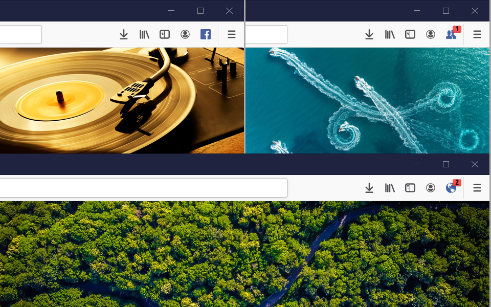

# Facebook Status
Toolbar extension for
Opera (~~https://addons.opera.com/en/extensions/details/facebook-status-2~~),
Chrome (~~https://chrome.google.com/webstore/detail/facebook-status/pmgibfcomaiaigfapndkcjilfjegjmfl~~) and
Firefox (https://addons.mozilla.org/en-US/firefox/addon/facebook-status/).

See your Facebook status (New Friend Requests~~, Messages~~ and Notifications) on a toolbar. Perfect for those who don't want to keep Facebook open all the time.
By clicking on the icon when the status change is shown, you'll be transferred directly to that status page.

This is how it looks in Firefox:

